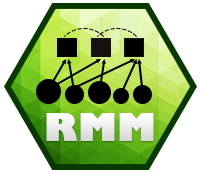
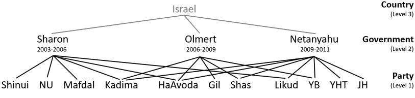

<!-- README.md is generated from README.Rmd. Please edit that file -->

```{r, include = FALSE}
knitr::opts_chunk$set(
  collapse = TRUE,
  comment = "#>",
  fig.path = "man/figures/README-",
  out.width = "100%"
)
```

# 

### Bayesian multiple membership multilevel regression models with endogenized weights

<!-- badges: start -->
[](https://github.com/benrosche/rmm/actions)
<!-- badges: end -->

*I am currently working on getting the package ready for a submission to CRAN.*

The rmm package provides an interface to fit Bayesian multiple membership multilevel models with endogenized weights using JAGS from within R for a variety of outcomes (linear, logit, conditional logit, Cox, Weibull).

Most multilevel analyses examine how lower-level units (e.g. individuals) are affected by their embedding in contextual/aggregate units at a higher level (e.g. neighborhoods) (= macro-micro link). The rmm package uses the multiple membership multilevel model to conceptually reverse this setup. It allows studying how the effect of units at lower levels propagates to a higher level (= micro-macro link).

Previous studies examining micro-macro links either aggregated or disaggregated the data. Both approaches obstruct the inherent aggregation problem, ignore dependencies among observations, which induces excessive Type-I and Type-II error, and cannot separate micro- from macro-level variance. The generalized multiple membership multilevel model (MMMM) is able to overcome these problems by explicitly modeling the aggregation from micro to macro level by including an aggregation function in the regression model. It is a theoretically and statistically sound solution to the study of micro-macro links with regression analysis.

### With the **rmm** package, you can...

- explicitly model how the effect of lower level units propagate to a higher level

- examine the fit of different aggregation functions, such as the min, max, mean, or sum

- uncover heterogeneity in the effect of lower-level units on higher-level entities

- control dependencies that arise from a multiple membership (crisscrossing) data structure

- estimate the (residual) variance at the lower and the higher level

This is the data structure that is being modeled:

#  

In this example of coalition governments in Israel, political parties are the level-1 units,
governments are the level-2 units, and the relationship between parties and governments is the multiple membership structure.

This is just an example. Multiple membership structures are ubiquitous in the real world. Other applications include:

- MMMM can be used to model **spatial structures**. Level-1 units, in this case, would be the neighborhoods in the 
  influence sphere of the focal neighborhood, and level-2 units would be the focal neighborhoods. 
  The benefit of using MMMM over other spatial regression models is that the weight matrix can be endogenized, 
  which is not currently possible with other    methods
- MMMM can be used to model **network structures**. While this possibility has been explored in other work (Tranmer et al. 2014),
  the MMMM allows to endogenize the weight matrix, which is not currently possible with other multiple membership
  multilevel software, such as brms or MLWiN.
- more multiple membership structures in the wild: multi-party wars, treaties, international organizations

This is how the ```rmm()``` function looks like:

``` r 
data(coalgov)
rmm(Y ~ 1 + X_l2 + 
      X_l3 + hm(id=id_l3, type=RE) +
      mm(id(id_l2, id_l1), mmc(X_l1), mmw(w ~ 1/n^exp(-(X_w)))), 
    family="Gaussian", data=coalgov)
```

### Developers

I welcome contributions to the package! Feel free to submit changes for review or contact me if you have any questions.

### Issues or Feature Requests
If you would like to log an issue or submit a feature request, please create a new issue or comment on an existing issue on [GitHub Issues](https://github.com/benrosche/rmm/issues) on this repo.

### Changelog
See [NEWS.md](https://github.com/benrosche/rmm/news/index.html) for the package changelog.

More information can be found [here](http://benrosche.com/projects/rmm/)
